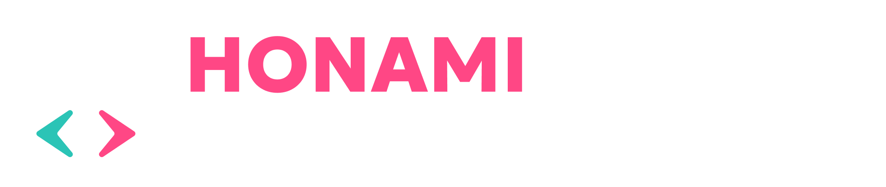
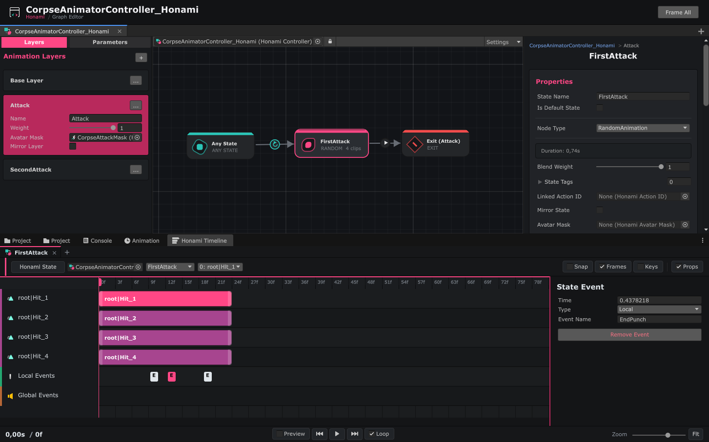
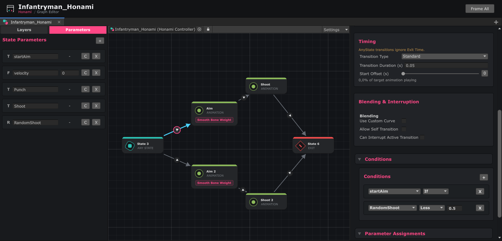
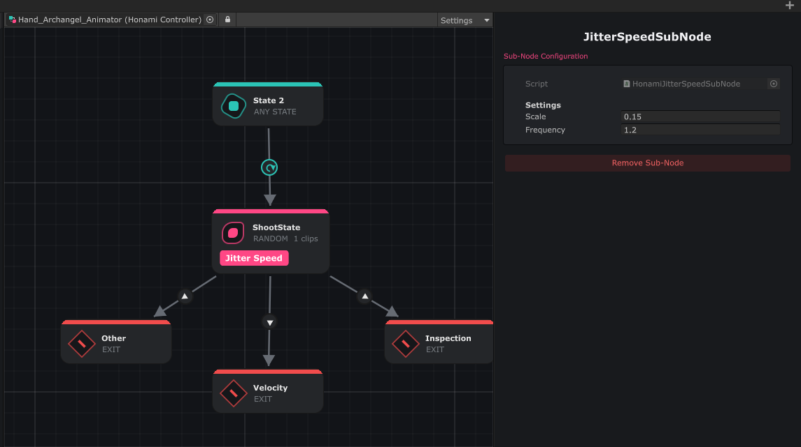
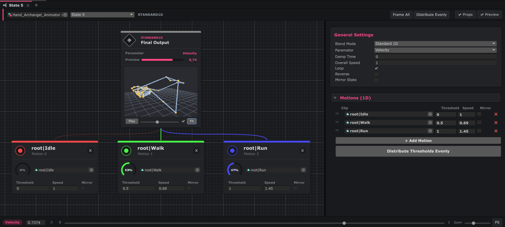

<p align="center">
  
</p>

<p align="center">
  <a href="https://github.com/loyal-studio/Honami-Animation-System/releases">
    
  </a>
  <a href="https://docs.unity3d.com/6000.0/Documentation/Manual/WhatsNewUnity6.html">
    
  </a>
  
  
</p>

<p align="center">
  <b>A high-performance, node-graph driven animation system for Unity 6 - built to replace the built-in Animator entirely.</b><br/>
  Rig-agnostic · Powerful node graph · Procedural by design · Zero-allocation runtime
</p>

## Overview

**Honami Animation System** is a complete, from-scratch alternative to Unity's built-in Animator. Designed for Unity 6, it gives you a powerful node-graph editor, built-in procedural rigging, pseudo-physics bones, and seamless Timeline integration - all at zero runtime allocation cost.

## Why Honami?

Unity's built-in Animator is great - until it isn't. On a fast, code-driven action game the friction adds up: the graph turns to spaghetti, state machines explode, control logic gets bolted awkwardly onto a black-box runtime, and non-humanoid characters mean fighting the Avatar Mask and retargeting workflow. Honami was built by a game team, for exactly that kind of project.

**The graph stays readable no matter how complex your character is.** Sub-Nodes keep secondary logic hidden inside states, while custom node types keep transitions clean and organized. Override Controllers let you reuse entire graphs across character variants without copy-pasting.

**Any skeleton, no Avatar dance.** To be clear: Unity animates, blends and masks Generic (non-humanoid) rigs perfectly well - blending is not a Humanoid privilege. The pain is the *workflow*: Avatar Masks for a generic rig are a manual transform tree with no body-part diagram, and Humanoid retargeting only exists for bipeds. Honami is rig-agnostic by design: bone-path masks, no Avatar setup, no retargeting step. Quadrupeds, spiders, mechs, vehicles and modular bosses all use the same pipeline with per-bone control.

**Procedural where it matters.** Unity has no built-in rigging system inside its Animator (requiring a heavy, separate package with its own performance and setup limitations). Honami comes with native, high-performance rigging constraints: dynamic Pose Constraints to inject procedural postures (like sliding, recoil, or holding weapons), LookAt targeting for bone chains with per-bone weights, and springy pseudo-physics - all running as a final correction pass on top of authored animation, not instead of it.

**One command, many characters.** The Linked Brain system broadcasts state transitions, parameter changes and action IDs to entire squads at once - with tag filtering, radius targeting and propagation waves. Crowd animation without a single loop in your game code.

**Zero runtime cost.** The evaluation loop produces no GC allocations per frame. Distant characters run at a capped FPS with smooth interpolation. Every API method has an integer-hash overload to keep hot paths allocation-free.

| Feature / Aspect | Built-in Animator | Honami |
|---|---|---|
| **Underlying Engine** | ⚠️ Evaluated by Unity's closed native Mecanim loop (black-box, non-extendable). | ✅ Direct C# evaluation stack driving the `PlayableGraph` API (Animator Controller slot left empty). |
| **Logic Style** | ⚠️ Standard Mecanim flat state machines (prone to transition spaghetti). | ✅ Modular runtime graphs supporting custom node types (`HonamiController`). |
| **Controller & Layer Reuse** | ❌ Swaps clips only (via `AnimatorOverrideController`). Duplicating layers requires manual copy-paste. | ✅ True controller inheritance and layer overrides with virtual states and parameter propagation. |
| **State Logic Extensibility** | ⚠️ `StateMachineBehaviour` (rigidly coupled to the GameObject, hard to pass references). | ✅ Sub-Nodes (`HonamiSubNodeBase`) with modular `OnEnter`/`Update`/`OnExit` lifecycle events. |
| **Blend Trees** | ✅ 1D and 2D blend trees. | ⚠️ 1D only (Standard and Simple); 2D blend space not supported yet (`HonamiBlendTreeNode`). |
| **Avatar & Masking** | ✅ Works on any rig, but generic masks are authored as a manual transform tree; the body-part diagram is Humanoid-only. | ✅ Bone-path mask atlas for any skeleton, no Humanoid Avatar required (`HonamiAvatar`). |
| **Rigging & Constraints** | ⚠️ Requires external Animation Rigging package (decoupled from animator, complex setup). | ✅ Built-in rig-agnostic constraints (`HonamiPoseConstraint`, `HonamiLookAtConstraint`) as a final pass. |
| **Timeline Integration** | ⚠️ Supported via Unity's Timeline package, but limited to basic clip playback (requires custom Playable scripts for state/parameter control). | ✅ Native tracks for state bindings, event sequencing, and live editor preview (`HonamiTimeline`). |
| **Performance & GC** | ❌ Runs evaluation every frame; allocates memory during string-based parameter queries. | ✅ Zero GC allocations at runtime (uses integer-hash overloads) with per-animator FPS caps. |
| **Live Debugging** | ❌ Basic active-state progress bar only. | ✅ Live node highlighting, active variables inspection, and transition progress tracking. |
| **Retargeting** | ✅ Humanoid muscle-space retargeting across different skeletons. | ❌ None - binds by transform path, so use a consistent skeleton per character. |
| **Version Control** | ⚠️ Monolithic AnimatorController asset; diffs can be noisy. | ✅ States and nodes are separate ScriptableObject assets, so changes stay localized. |

> **Honest scope.** Honami is a specialized tool for code-driven action games (FPS, character-action, slashers) and custom or exotic skeletons - not a general Mecanim replacement for every project. It has no Humanoid muscle-space retargeting, its blend trees are 1D only, and overlays use masked layers (additive / aim-offset is on the roadmap).

### Clean graphs, not spaghetti

The built-in Animator becomes an unreadable mess as a project grows. Honami keeps graphs clean with **Sub-Nodes** - secondary logic like sounds, VFX, or IK hints lives *inside* a state, invisible in the main flow. You see only what matters.

### Honami Timeline & Animation Events

If you have ever worked with animations in Unity, you know how crucial **Animation Events** are for triggering actions at precise frames (such as dealing damage during a sword slash or playing a reload sound). In the standard Unity Animator, this system is poorly implemented: events are baked directly into the animation clip itself and strictly couple the assets to your codebase.

Honami takes a completely different approach, offering two independent event systems:
* **Local Event** - Allows you to invoke local `UnityEvent` actions on a specific GameObject using the `HonamiLocalEventReceiver` component.
* **Global Event** - A broadcasting system to propagate events globally across the entire scene via `HonamiGlobalEvent`.

This is where the `HonamiTimeline` comes in. Instead of baking events into imported FBX files, you bind these events locally to the animation states (States) within your Honami Controller. You simply position the event triggers on the timeline where and when they should fire. This keeps your source animation clips 100% clean, and keeps the event logic exactly where it is easiest to manage.

Additionally, the Timeline greatly simplifies debugging. It allows you to preview animation clips and test individual states directly inside the Unity Editor. For example, you can visually test how animation blending with a `HonamiAvatarMask` works without ever entering Play Mode.

### Built-in Rig System

In standard Unity development, rigging constraints require the external **Animation Rigging** package - a separate dependency, decoupled from the Animator, with its own GameObject-based setup to wire up.

Honami includes a high-performance, rig-agnostic constraint pipeline out of the box. No external packages, no humanoid limitations, and zero runtime setup overhead.

All rigs run as a final correction pass after animation sampling, so authored animation stays in control while procedural adjustments handle contacts, aiming, secondary motion and physics.

**Pose Constraint** - Procedurally injects static or dynamic poses directly into bone hierarchies. Allows you to easily enforce offsets and target alignments for specific actions (such as a sliding stance, crouch adjustments, or holding weapons in hands) in either local or world space, with full weight control.

**LookAt Constraint** - Rotates one or a chain of bones toward a target using custom aim/up axes. Handles heads, eyes, turrets, weapon barrels, creature sensors and long necks (spine → neck → head, each with independent weight). Additive mode works on top of authored animation without overwriting it.

**Point Constraint** - Locks a transform to another transform's position and/or rotation with authored offsets. Keeps weapon sockets, armor plates, held objects and split-body pieces perfectly aligned without turning them into Humanoid bones.

**Pivot Fixer** - Solves the "wrong imported pivot" problem. Stabilizes weapon grips, door hinges, tool handles and creature attachment points by picking a different effective anchor than what the FBX provides.

**Pseudo-Physics** - Adds springy inertia and secondary motion to any list of bones: hair, tails, cloth strips, antennae, cables, soft armor, weapon sway. Lightweight by design - no Rigidbody chains, no full physics sim, just the feel of weight and follow-through.

And much more!

### One brain, many characters

The **Linked Brain** system lets you send a single command - a parameter change, a state transition, an action ID - to dozens of animators at once. Tag filtering, radius targeting, propagation waves: orchestrate entire crowds with precision and zero boilerplate.

### Zero cost where it matters

The evaluation loop produces **zero GC allocations** per frame. Distant characters can evaluate at a fixed 15 or 30 FPS with smooth interpolation via the per-animator **FPS Cap** - a free LOD system for animation.

### Works with any rig

Honami is rig-agnostic. Human, dragon, spider, vehicle - all treated with the same pipeline: bone-path masks, no Avatar setup, no retargeting step, full control over every bone. (If you need to retarget marketplace Humanoid clips across different skeletons, that is a job for Unity's Humanoid pipeline, not Honami.)

## Screenshots

<p align="center">
  
  <br/><br/>
  
  <br/><br/>
  
  <br/><br/>
  
</p>

## Used in Production

Honami powers all animation in **[Daisen](https://store.steampowered.com/app/3702380/Daisen/)** - a fast-paced action game built by LOYAL Studio.

## Installation

### Via Unity Package Manager (Git URL) *(recommended)*

1. Open **Window → Package Manager**.
2. Click the **＋** button → **Add package from git URL…**
3. Paste:
   ```
   https://github.com/loyal-studio/Honami-Animation-System.git
   ```
4. Click **Add** and wait for import to complete.
5. The **Welcome to Honami** window will open automatically on first launch.

## Documentation

Open **Window → Honami → Documentation** directly inside Unity. The built-in docs cover everything: graph authoring, transitions, blend trees, avatars and masks, IK and constraints, the Linked Brain system, the full scripting API, and the optimization guide - with live code examples you can copy with one click.

## Contributing

Contributions, bug reports and feature requests are welcome!

## License

This project is licensed under the **MIT License** - see [LICENSE](LICENSE) for details.

<p align="center">
  Made with Love by <a href="https://github.com/loyal-studio"><b>LOYAL Studio</b></a>
</p>
